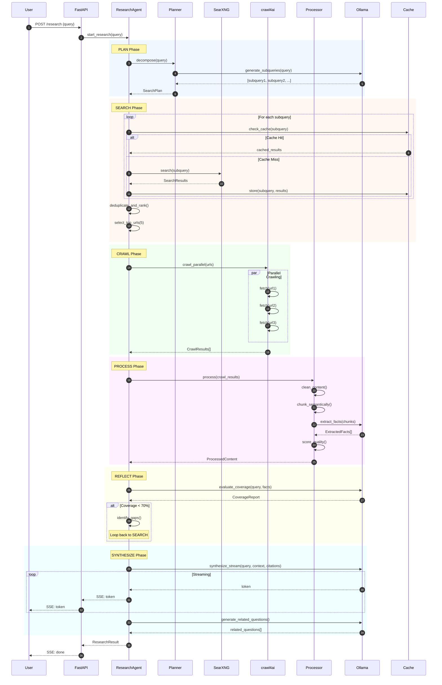
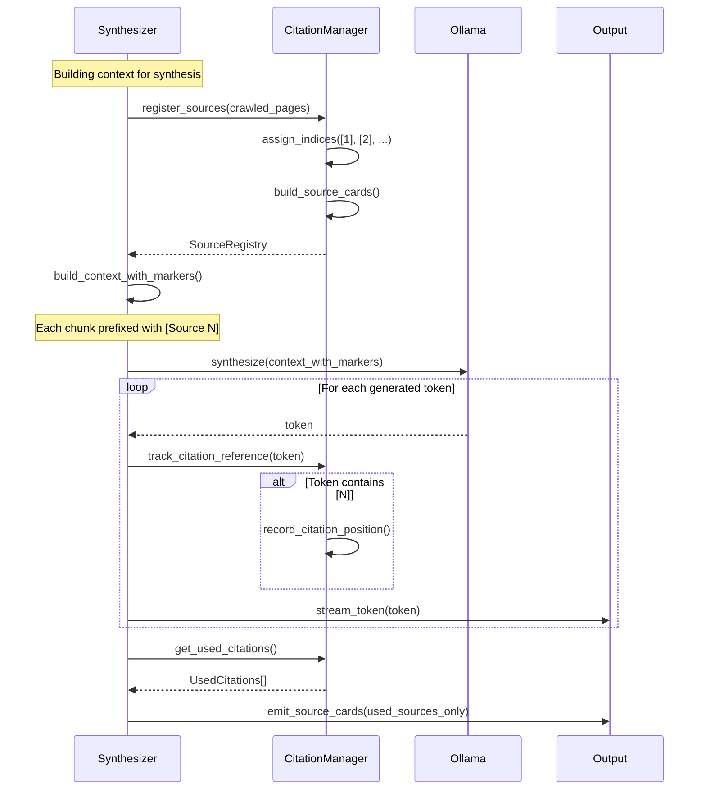
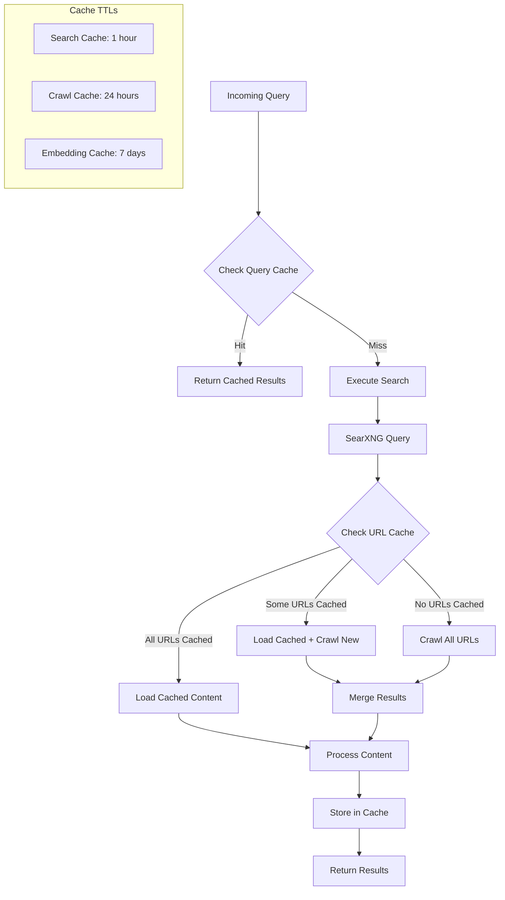
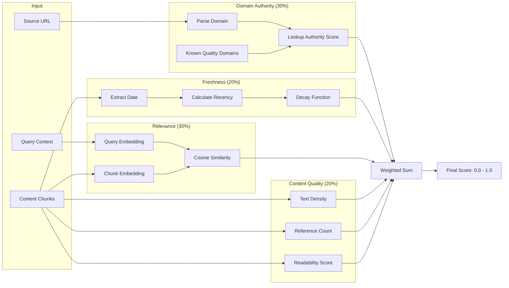
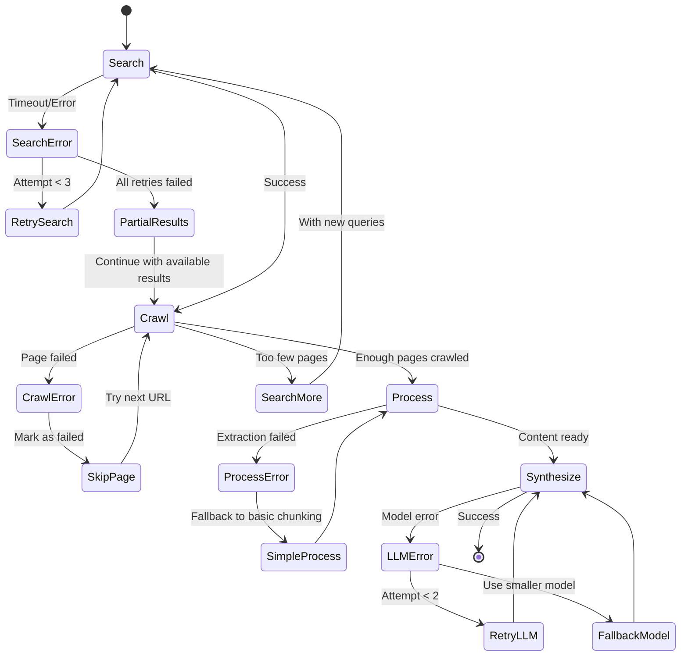
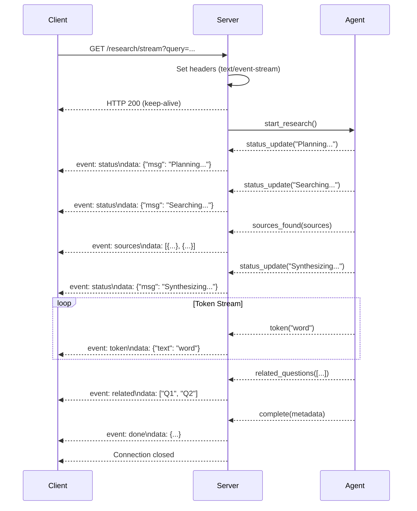
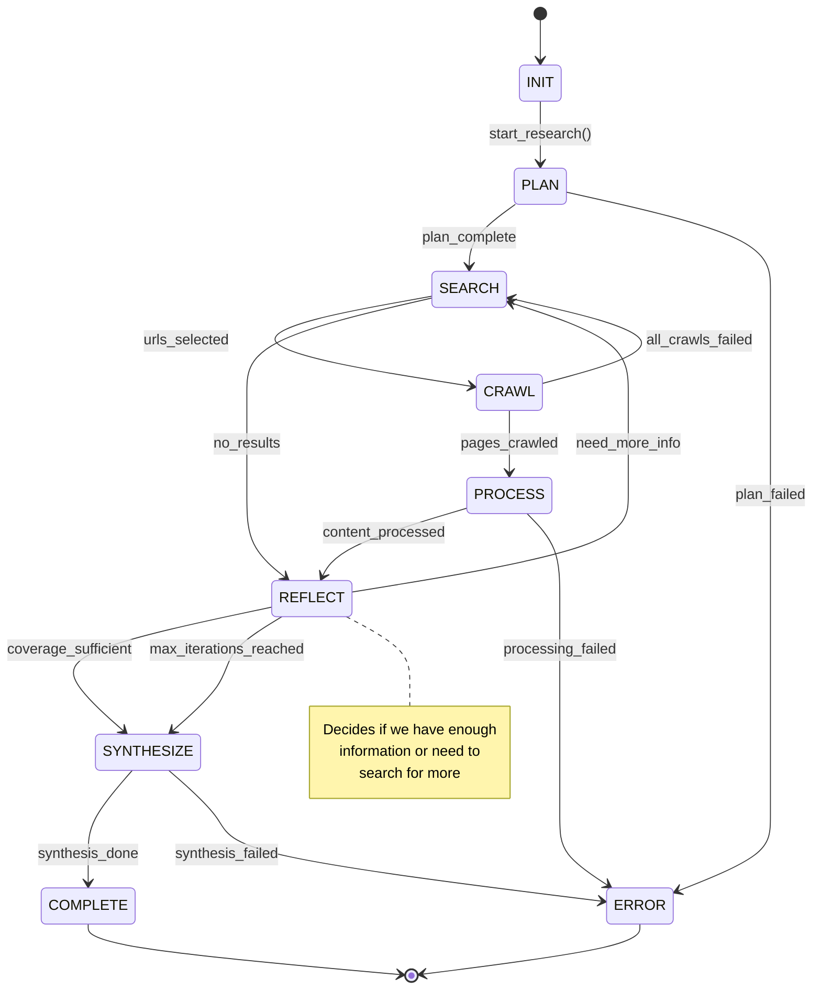
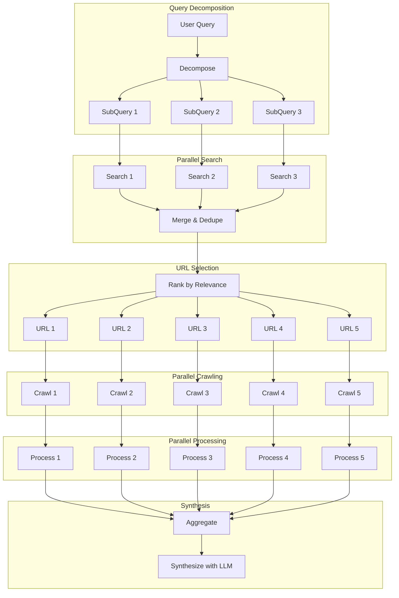

# Diogenes Data Flow Diagrams

## 1. Complete Research Flow

## 2. Citation Tracking Flow

## 3. Caching Strategy Flow

## 4. Quality Scoring Pipeline

## 5. Error Recovery Flow

## 6. Streaming SSE Protocol

## 7. Agent State Transitions

## 8. Parallel Processing Architecture

